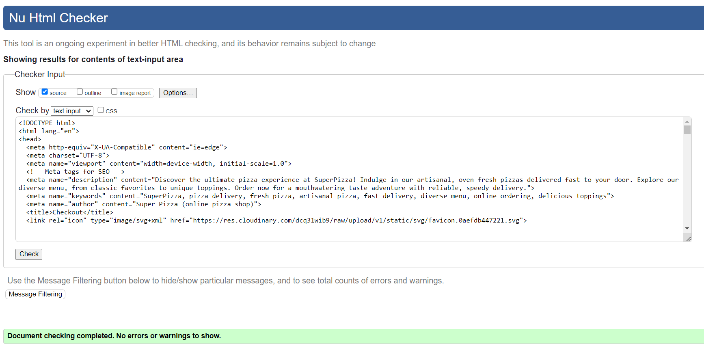

# Super Pizza

## Planning & Development

### Target Audience

### App Objectives

### Features to Implement

### Wireframes

Pizza Page

  
  
  

Pizza Details Page

  
  
  

Pizza Tracker Page

  
  

Pizza Order Page

  
  

Pizza Order Details Page

  
  

Profile and Order History Pages

  
  

Pizza Basket Page

  

### Database Schema

### Colors

### Fonts

### Technologies

### Agile

## Marketing

### SEO

### Keywords

### Social Media

*Go back to the [top](#super-pizza)*

## Features

### Existing Features

### Features to Implement

*Go back to the [top](#super-pizza)*

## Testing

### Manual Testing

#### Authentication

  - Verified the functionality of the registration form, ensuring all required fields are present and functional.

  - Validated the form's behavior when submitting incomplete or erroneous data (e.g., missing fields, invalid email format).
  - Tested the form's responsiveness across various devices to ensure usability.
  - Checked that successful registration results in the creation of a user account.

  - Verified that users receive confirmation emails.

  - Tested the login functionality to authenticate registered users.

  - Verified that incorrect login credentials trigger appropriate error messages.
  - Tested the "Forgot Password" feature to confirm its functionality in allowing users to reset their passwords.

#### Authorization

  - Authenticated User
    - Confirmed that authenticated users can access and manage their profiles.
    - Validated the functionality to view order history and edit personal details for checkout.
    - Verified that authenticated users with at least one order can write testimonials.
    - Ensured testimonial submission is restricted until the user meets the minimum order requirement.

  - Worker
    - Tested the additional "Orders" navigation link accessible to workers.

  - Admin
    - Validated additional profile dropdown menu options available to admins.
    - Confirmed functionality to add pizzas, toppings, and provide testimonials from the admin profile.
    - Checked access to the admin panel through the designated navigation link.

Admin Authorization

  
  
  
  
  

    - Verified admin privileges within the admin panel, including editing/deleting products and testimonials.
    - Ensured that under product cards (e.g., pizzas, toppings), admins can access links to edit or delete them.
    - Verified admin access to approving or deleting testimonials.

#### Form Validation

  - Validated Add Pizza form.

  - Validated Edit Pizza form.
  - Validated Add Topping form.
  - Validated Edit Topping form.
  - Validated Login form.
  - Validated Registration form.
  - Validated Profile form.
  - Validated Checkout form.
  - Validated Provide Testimonial form.
  - Validated Track Order form.

#### Crud

#### Price

#### Bag

#### Checkout

#### Tracking System

#### Profiles

#### Testimonials

#### UX

#### Responsiveness

#### Navbar

  - The navbar has been tested on all pages and all links are working correctly.
  - The navbar has been tested on all screen sizes and the links are displayed correctly.
  - The selected page link is highlighted in the navbar.
  - The dropdown menu has been tested on all screen sizes and the menu works correctly.
  - The burger appears on small screens and the menu is displayed when the burger is clicked.
  - The links in the burger menu have been tested and all links are working correctly.
  - Authenticated users can view and access their profiles from the dropdown menu located under the profile icon.
  - Workers can see and have access to Orders link.
  - Admins can see and have access to Orders and Admin links. From the dropdown menu of the profile icon, the admin has additional options to add pizza, add toppings, and provide testimonials.

#### Footer

  - The footer appears on all pages.
  - The footer is displayed correctly on all screen sizes.
  - The footer links have been tested and all links are working correctly.
  - The MailChimp subscription form has been tested and the form works correctly.
  - The information like "Opening Hours", "Our Location" and "Contact Us" is displayed correctly.

### HTML Validation

  - All HTML files have been validated using the W3C HTML Validator, with no errors or warnings found.

Login, Sign Up

  
  

Pizza List, Pizza Detail, Add and Edit Products Forms

  
  
  
  
  
  

Shopping Bag, Checkout, Checkout Success, Profile

  
  
  
  

About, Testimonials, Provide Testimonials

  
  
  

Order Status Management, Tracker, Tracker Progress Bar

  
  
  

### CSS Validation

  - The CSS code has been validated using the W3C CSS Validator (Jigsaw), and no errors were found.

Order Status Management, Tracker, Tracker Progress Bar

  
  
  
  

### JavaScript Validation

  - The JavaScript file has been validated using the JSHint JavaScript Validator, and no errors were detected."

Validated bag.js, checkout_stripe.js, products_pizza_detail, products_pizza_list.png, static_index.js files

  
  
  
  
  

### Python Validation

  - The Python PEP8 validation tests were performed to assess the adherence of the application's Python code to the PEP8 style guide and no errors were detected.

Validated python files from about app

  
  

Validated python files from bag app

  
  
  

Validated python files from checkout app

  
  
  
  
  
  
  
  
  

Validated python files from order_status_management app

  
  
  

Validated python files from order_tracker app

  
  
  

Validated python files from products app

  
  
  
  
  
  

Validated python files from profiles app

  
  
  
  

Validated python files from superpizza app

  
  

Validated python files from testimonial app

  
  
  
  

Validated python files from users app

  

### LightHouse

### User Stories Testing

### Bugs

*Go back to the [top](#super-pizza)*

## Deployment

## Credits

## Acknowledgements