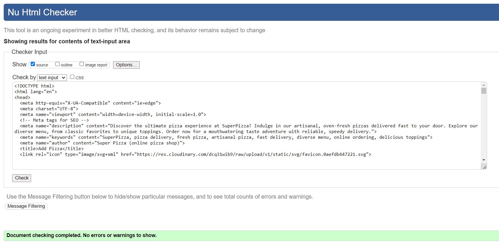
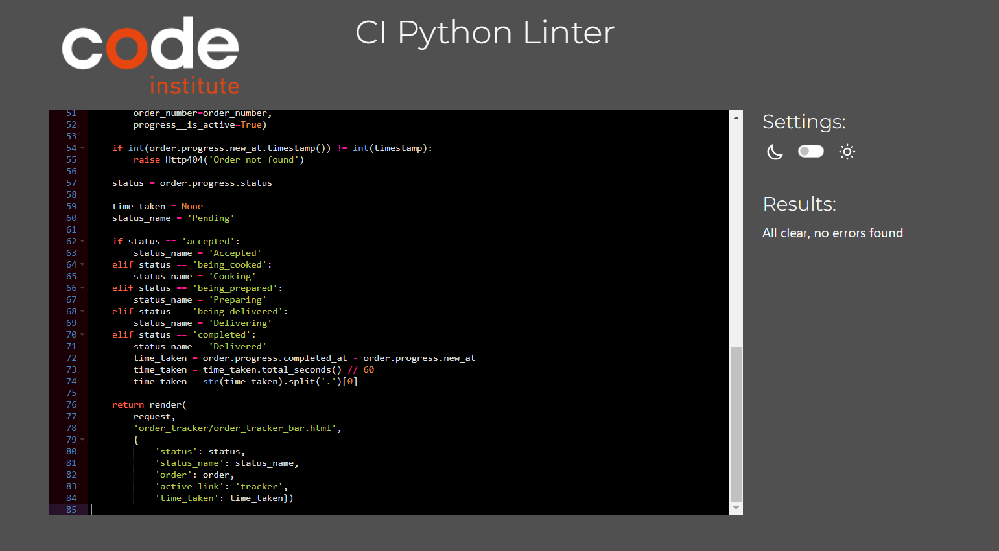

# Super Pizza

## Planning & Development

### Target Audience

### App Objectives

### Features to Implement

### Wireframes

Pizza Page

  
  
  

Pizza Details Page

  
  
  

Pizza Tracker Page

  
  

Pizza Order Page

  
  

Pizza Order Details Page

  
  

Profile and Order History Pages

  
  

Pizza Basket Page

  

### Database Schema

### Colors

### Fonts

### Technologies

### Agile

## Marketing

### SEO

### Keywords

### Social Media

*Go back to the [top](#super-pizza)*

## Features

### Existing Features

### Features to Implement

*Go back to the [top](#super-pizza)*

## Testing

### Manual Testing

#### Auth

  - Workers have access to additional links, such as 'Orders,' allowing them to view and modify the status of active orders.

#### Pizza List Page

  - The Pizza List page has been tested on all screen sizes and the page is displayed correctly.
  - The pizza is filtered correctly by selecting the right criteria. Users can filter by multiple values.
  - Users also have the option to search for pizza by title or description.
  - The size buttons on the pizza card change the price of the pizza correctly.
  - Pizza is visually changing when size changes.
  - Add to Bag' button adds the pizza to your bag, and a message confirming the addition appears below the bag icon.
  - Clicking on the pizza image redirects to the details page for that specific pizza.

#### Pizza Details Page
  - The pizza details page displays correctly on screens of all sizes.
  - The pizza details page displays the correct pizza image, name, description, price.
  - The selected toppings under the pizza are visually highlighted and written in the pizza description, while the price is accurately updated.
  - A maximum of seven toppings can be selected.
  - The prices of both toppings and pizza change based on the selected size.
  - The price of the pizza increases accurately with each added topping.
  - The "Add to Bag" button adds the pizza to the bag and a message confirming the addition appears below the bag icon.

#### Bag Page

  - The bag page displays correctly on screens of all sizes.
  - The bag page displays the pizza cards that have been added to the bag.
  - If there are no items in the bag, only a button is displayed that redirects to the pizza page.
  - The card displays essential information such as the pizza name, extra toppings, pizza size, price, quantity, and pizza image.
  - Just above the pizza cards, it shows the number of items added to the bag, while next to the checkout button, it displays the grand total price, pizza price, and delivery cost.
  - The quantity of pizza can be changed by clicking the decrement or increment buttons, adjusting one pizza with each click. The price and quantity change accordingly.
  - Clicking on the 'remove' button removes the entire card, regardless of the number of pizzas, and the price is updated accordingly.
  - The "Checkout" button redirects to the checkout page.

#### Checkout Page
  - The checkout page displays correctly on screens of all sizes.
  - To place an order, users need to complete the form on the checkout page and make the payment by filling in their card details in the provided form.
  - If an incorrect value is entered into the payment field, it will be dynamically highlighted below the field.
  - After a successful payment, the user is redirected to the checkout success page.

#### Checkout Success Page
  - On the checkout success page, users receive details about the order, including the order number.
  - Additionally, there's a button that redirects to the order progress tracking page, showing the journey from order acceptance to delivery.

#### Tracking System

#### Profiles

#### Testimonials

#### About Page
  
  - The About page has been tested on all screen sizes and the page is displayed correctly.

#### Navbar

  - The navbar has been tested on all pages and all links are working correctly.
  - The navbar has been tested on all screen sizes and the links are displayed correctly.
  - The selected page link is highlighted in the navbar.
  - The dropdown menu has been tested on all screen sizes and the menu works correctly.
  - The burger appears on small screens and the menu is displayed when the burger is clicked.
  - The links in the burger menu have been tested and all links are working correctly.
  - Authenticated users can view and access their profiles from the dropdown menu located under the profile icon.
  - Workers can see and have access to Orders link.
  - Admins can see and have access to Orders and Admin links. From the dropdown menu of the profile icon, the admin has additional options to add pizza, add toppings, and provide testimonials.

#### Footer

  - The footer appears on all pages.
  - The footer is displayed correctly on all screen sizes.
  - The footer links have been tested and all links are working correctly.
  - The MailChimp subscription form has been tested and the form works correctly.
  - The information like "Opening Hours", "Our Location" and "Contact Us" is displayed correctly.

### HTML Validation

  - All HTML files have been validated using the W3C HTML Validator, with no errors or warnings found.

Login, Sign Up

  
  

Pizza List, Pizza Detail, Add and Edit Products Forms

  
  
  
  
  
  

Shopping Bag, Checkout, Checkout Success, Profile

  
  
  
  

About, Testimonials, Provide Testimonials

  
  
  

Order Status Management, Tracker, Tracker Progress Bar

  
  
  

### CSS Validation

  - The CSS code has been validated using the W3C CSS Validator (Jigsaw), and no errors were found.

Order Status Management, Tracker, Tracker Progress Bar

  
  
  
  

### JavaScript Validation

  - The JavaScript file has been validated using the JSHint JavaScript Validator, and no errors were detected."

Validated bag.js, checkout_stripe.js, products_pizza_detail, products_pizza_list.png, static_index.js files

  
  
  
  
  

### Python Validation

  - The Python PEP8 validation tests were performed to assess the adherence of the application's Python code to the PEP8 style guide and no errors were detected.

Validated python files from about app

  
  

Validated python files from bag app

  
  
  

Validated python files from checkout app

  
  
  
  
  
  
  
  
  

Validated python files from order_status_management app

  
  
  

Validated python files from order_tracker app

  
  

Validated python files from products app

  
  
  
  
  
  

Validated python files from profiles app

  
  
  
  

Validated python files from superpizza app

  
  

Validated python files from testimonial app

  
  
  
  

Validated python files from users app

  

### LightHouse

### User Stories Testing

### Bugs

*Go back to the [top](#super-pizza)*

## Deployment

## Credits

## Acknowledgements