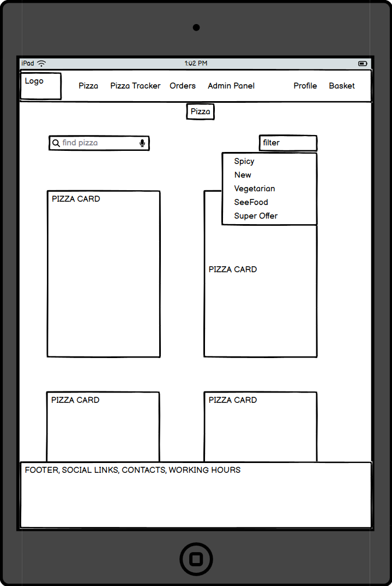
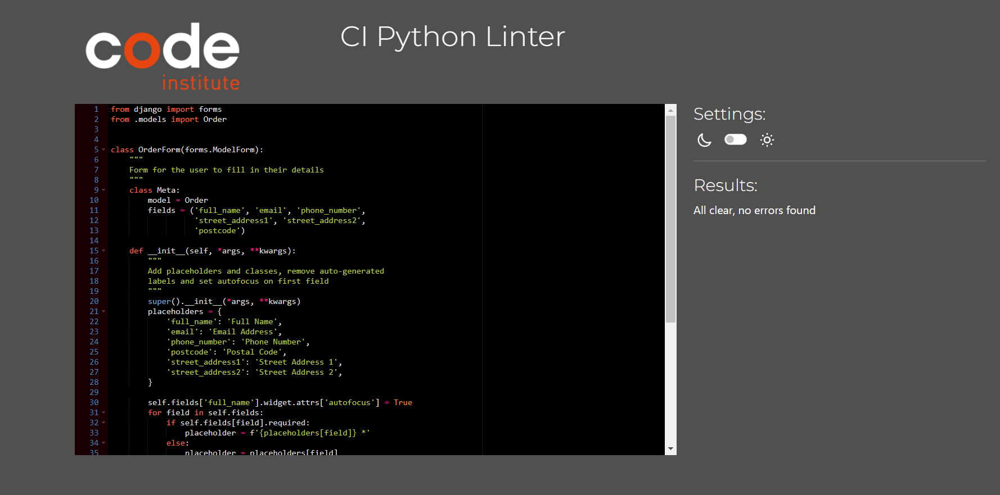
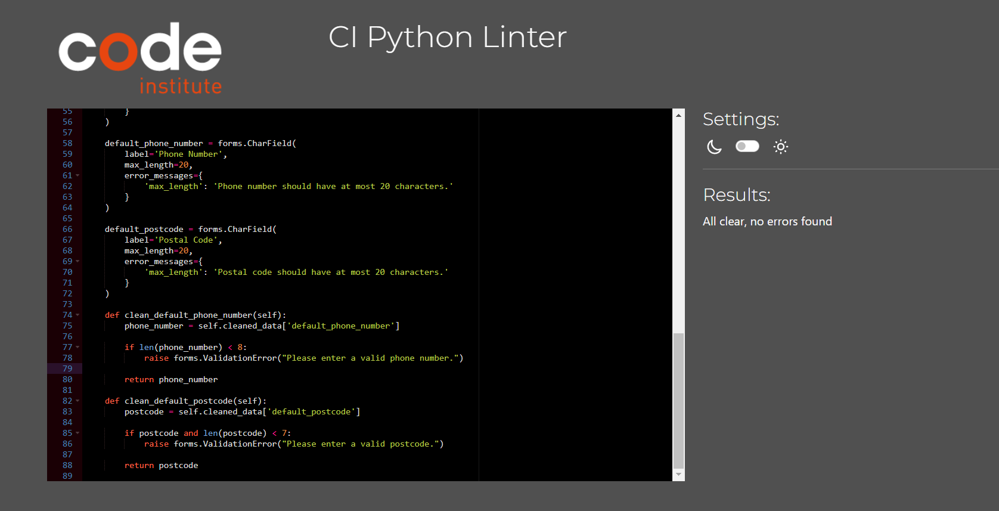
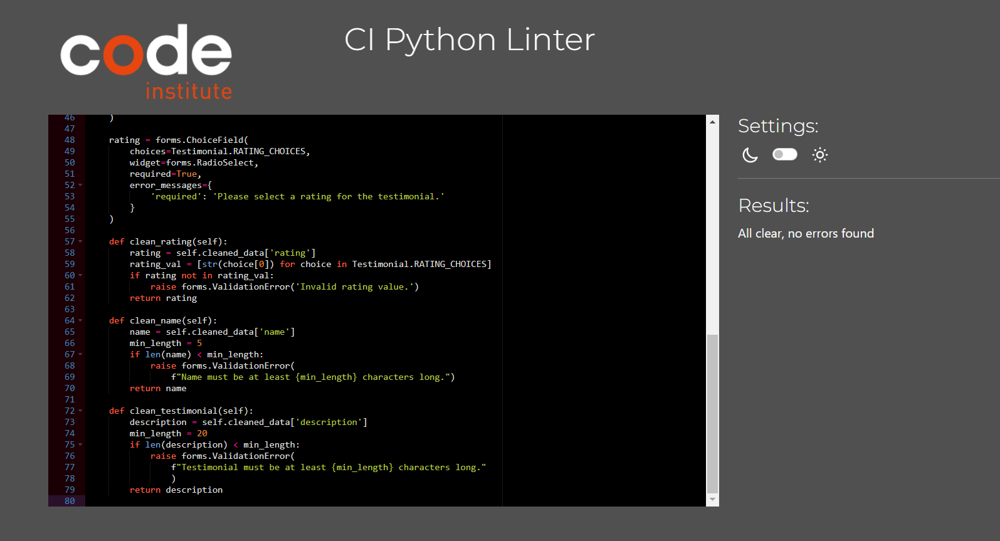

# Super Pizza

## Planning & Development

### Target Audience

### App Objectives

### Features to Implement

### Wireframes

Pizza Page

  
  
  

Pizza Details Page

  
  
  

Pizza Tracker Page

  
  

Pizza Order Page

  
  

Pizza Order Details Page

  
  

Profile and Order History Pages

  
  

Pizza Basket Page

  

### Database Schema

### Colors

### Fonts

### Technologies

### Agile

## Marketing

### SEO

### Keywords

### Social Media

*Go back to the [top](#super-pizza)*

## Features

### Existing Features

### Features to Implement

*Go back to the [top](#super-pizza)*

## Testing

### Manual Testing

### HTML Validation

  - All HTML files have been validated using the W3C HTML Validator, with no errors or warnings found.

Login, Sign Up

  
  

Pizza List, Pizza Detail, Add and Edit Products Forms

  
  
  
  
  
  

Shopping Bag, Checkout, Checkout Success, Profile

  
  
  
  

About, Testimonials, Provide Testimonials

  
  
  

Order Status Management, Tracker, Tracker Progress Bar

  
  
  

### CSS Validation

  - The CSS code has been validated using the W3C CSS Validator (Jigsaw), and no errors were found.

Order Status Management, Tracker, Tracker Progress Bar

  
  
  
  

### JavaScript Validation

  - The JavaScript file has been validated using the JSHint JavaScript Validator, and no errors were detected."

Validated bag.js, checkout_stripe.js, products_pizza_detail, products_pizza_list.png, static_index.js files

  
  
  
  
  

### Python Validation

  - The Python PEP8 validation tests were performed to assess the adherence of the application's Python code to the PEP8 style guide and no errors were detected.

Validated python files from about app

  
  

Validated python files from bag app

  
  
  

Validated python files from checkout app

  
  
  
  
  
  
  
  
  

Validated python files from order_status_management app

  
  
  

Validated python files from order_tracker app

  
  

Validated python files from products app

  
  
  
  
  
  

Validated python files from profiles app

  
  
  
  

Validated python files from superpizza app

  
  

Validated python files from testimonial app

  
  
  
  

Validated python files from users app

  

### LightHouse

### User Stories Testing

### Bugs

*Go back to the [top](#super-pizza)*

## Deployment

## Credits

## Acknowledgements