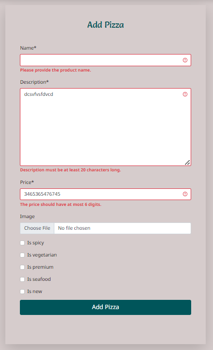
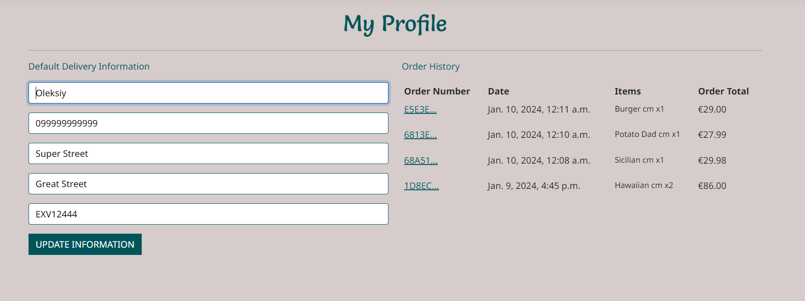
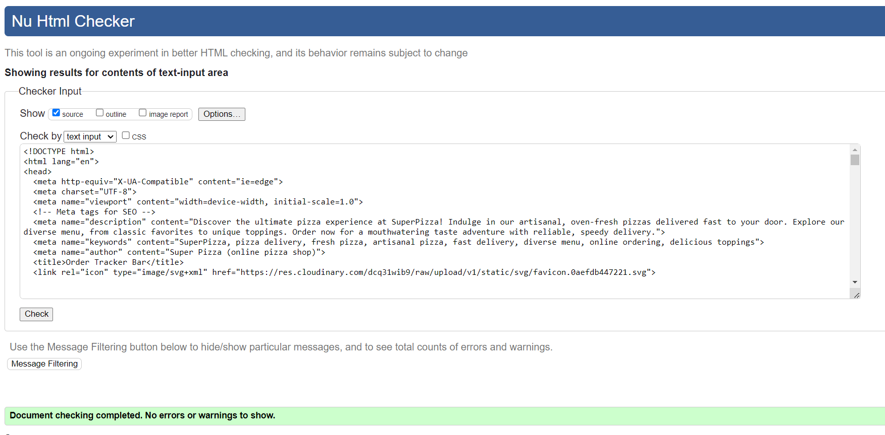
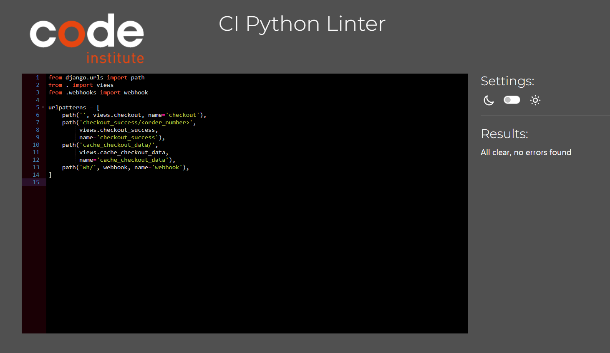
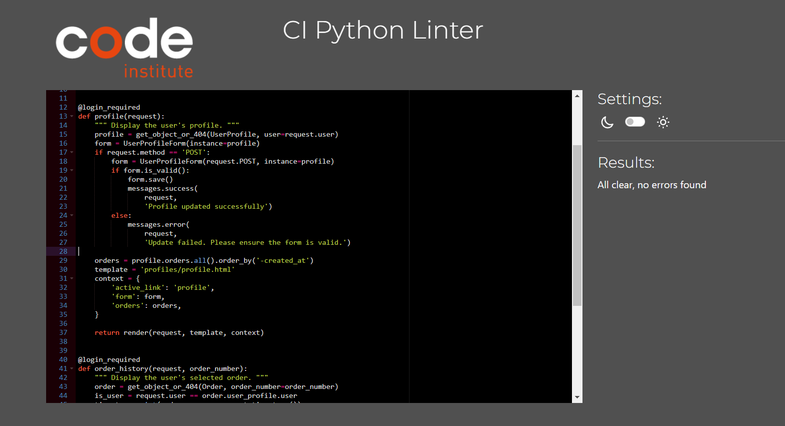

# Super Pizza

Superpizza, our online delivery store in Tralee, offers a seamless user experience, designed for easy navigation. Customers can explore our diverse range of pizzas, select their preferred size, and personalize it by adding extra toppings. They also have the convenience of leaving testimonials to share their experiences.

Our platform includes a secure online payment system and provides an option to track order status from the moment an order is placed until it reaches your doorstep. The intuitive design extends to our workers and administrators, granting them the ability to efficiently manage orders, approve or remove testimonials, and effortlessly modify the store's products such as pizzas and toppings.

 

## Planning & Development

### Target Audience

  - Busy Professionals: Individuals who lack time to cook and prefer the convenience of ordering food online.
  - Families: Parents looking for quick meal solutions or a treat for their children without leaving home.
  - Students: Those living on campus or in nearby areas who enjoy the ease of online ordering for gatherings or individual meals.
  - Food Enthusiasts: People who appreciate customization and quality ingredients in their pizzas.
  - Tech-Savvy Users: Those comfortable with online platforms and seeking a streamlined, user-friendly ordering experience.
  - Local Community Members: Individuals supporting local businesses and seeking easy access to delicious, freshly made pizzas in their area.

### App Objectives

  - User Convenience: Simplify the pizza ordering process for customers, ensuring a seamless and user-friendly interface.
  - Customization: Allow customers to personalize their orders by choosing pizza size, toppings.
  - Efficient Order Management: Enable workers and administrators to efficiently manage orders, ensuring timely processing and delivery.
  - Enhanced Customer Experience: Provide a platform for customers to leave testimonials and feedback, fostering a sense of engagement and trust.
  - Secure Payment Processing: Implement a reliable and secure online payment system to facilitate smooth transactions.
  - Order Tracking: Offer customers the ability to track their orders from placement to delivery, enhancing transparency and reliability.
  - Scalability: Build a platform that can adapt and scale with the growing business needs, accommodating potential expansions or modifications to the menu or services.
  - Marketing and Analytics: Incorporate features to gather data on customer preferences and behavior, aiding in targeted marketing efforts and service improvements.

### Features to Implement

  - Convenient Real-Time Tracking System: Allow users to track their orders in real-time, providing updates from acceptance to delivery stages.
  - Order Management for Workers: A dashboard for workers to view all active new orders and update their status from 'new' to 'done' upon completion.
  - Online Payment System: Integrate a secure online payment gateway for seamless transactions within the app.
  - Registration and Login: Enable users to create accounts and log in to access personalized features and order history.
  - Pizza List Page with Filters: Present a comprehensive list of available pizzas with filter options for easy browsing.
  - Pizza Details and Customization: Offer a detailed view of each pizza with customization options, including the ability to change size, add extra toppings.
  - Add to Bag Functionality: Allow users to add selected items to their shopping bag for a streamlined ordering process.
  - Profile Page for Registered Users: Provide a dedicated space for registered users to manage their information and view past orders.
  - Testimonials Submission: Enable customers to write testimonials to share their experiences with Superpizza.
  - Testimonials Management for Admins: Admins can review, approve and delete testimonials submitted by customers to maintain the integrity of displayed reviews.
  - Store Product Management for Admins: Grant admins the capability to manage products in the store, including adding, editing, or deleting pizzas and toppings from the menu.
  - Responsive Design: Ensure the app is responsive across various devices and screen sizes.

### Wireframes

Pizza Page

  
  
  

Pizza Details Page

  
  
  

Pizza Tracker Page

  
  

Pizza Order Page

  
  

Pizza Order Details Page

  
  

Profile and Order History Pages

  
  

Pizza Basket Page

  

### Database Schema

### Colors

### Fonts

### Technologies

### Agile

## Marketing

### SEO

### Keywords

### Social Media

*Go back to the [top](#super-pizza)*

## Features

### Existing Features

### Features to Implement

*Go back to the [top](#super-pizza)*

## Testing

### Manual Testing

#### Authentication

  - Verified the functionality of the registration form, ensuring all required fields are present and functional.

  - Validated the form's behavior when submitting incomplete or erroneous data (e.g., missing fields, invalid email format).
  - Tested the form's responsiveness across various devices to ensure usability.
  - Checked that successful registration results in the creation of a user account.

  - Verified that users receive confirmation emails.

  - Tested the login functionality to authenticate registered users.

  - Verified that incorrect login credentials trigger appropriate error messages.
  - Tested the "Forgot Password" feature to confirm its functionality in allowing users to reset their passwords.

#### Authorization

- Authenticated User
  - Confirmed that authenticated users can access and manage their profiles.
  - Validated the functionality to view order history and edit personal details for checkout.
  - Verified that authenticated users with at least one order can write testimonials.
  - Ensured testimonial submission is restricted until the user meets the minimum order requirement.

- Worker
  - Tested the additional "Orders" navigation link accessible to workers.

- Admin
  - Validated additional profile dropdown menu options available to admins.
  - Confirmed functionality to add pizzas, toppings, and provide testimonials from the admin profile.
  - Checked access to the admin panel through the designated navigation link.

Admin Authorization

  
  
  
  
  

  - Verified admin privileges within the admin panel, including editing/deleting products and testimonials.
  - Ensured that under product cards (e.g., pizzas, toppings), admins can access links to edit or delete them.
  - Verified admin access to approving or deleting testimonials.

#### Form Validation

  - Validated Add Pizza form.

  - Validated Edit Pizza form.

  - Validated Add Topping form.

  - Validated Edit Topping form.

  - Validated Login form.

  - Validated Registration form.

  - Validated Profile form.

  - Validated Checkout form.

  - Validated Provide Testimonial form.

  - Validated Track Order form.

#### Crud

  - Verified that admins can successfully add new pizzas and toppings to the system.

  - Verified that admins can successfully update pizza or topping.

  - Verified that admins can successfully delete pizza or topping.

  - Confirmed that images associated with pizzas or toppings created and deleted in Cloudinary.
  - Ensured the ability for users to create testimonials and submit them successfully.
  - Validated admin functionality to approve submitted testimonials.

  - Confirmed that admins can delete testimonials as needed.

  - Verified that users can add pizzas to their shopping bag successfully.

  - Tested the removal of pizzas from the bag to ensure functionality.

  - Confirmed that users can modify the quantity of pizzas in their bag and that these changes reflect accurately.

  - Validated the ability for users to add toppings to their pizzas.

#### Price

  - Confirmed that the price of a pizza changes correctly based on the selected size (30cm, 35cm, 40cm).

  - Validated that the price of extra toppings adjusts according to the size of the pizza.

  - Verified that adding extra toppings increases the pizza's price by the respective cost of each topping.

  - Ensured that the delivery cost is correctly applied or omitted based on the total price of pizzas in the order.

  - Confirmed that the grand total price changes accurately based on the quantity of pizzas added to the shopping bag.

  - Checked that all applicable adjustments (size, toppings, delivery cost) reflect in the final calculated total.

#### Payment

  - Verified that items added to the shopping bag correctly transfer to the checkout page.
  - Ensured the displayed prices in the checkout match those in the shopping bag.
  - Validated the input of card details for payment.
  - Confirmed that the price taken during the payment process matches the total displayed during checkout.

  - Validated successful payment events in the Stripe dashboard.

  - Tested and verified webhook functionality to ensure it works as expected.

  - Checked that users receive an order confirmation email after successful payment and completion of the checkout process.

  - Confirmed that users are redirected to a "Checkout Success" page after completing the payment. Validated that this page displays relevant order details such as items purchased, total cost, and delivery information.

#### Profiles
  - Ensured that the details entered in the profile form are pre-filled in the checkout form for user convenience.

  - Confirmed that the orders in the profile are displayed in chronological order, with the most recent order at the top.
  - Tested the functionality to view detailed information for each order upon clicking.

  - Verified that for active orders, a track order button is displayed within the order details.
  - Ensured the functionality of the track order button to provide real-time status updates for the user.

#### Tracking System

  - Confirmed that when a customer purchases a pizza, an active order is created for tracking purposes.
  - Tested the functionality to display the order's status progression (pending, accepted, cooking, preparing, delivering, delivered) on the customer's screen via a progress bar.
  - Ensured that status changes made by workers or admins are instantly reflected on the customer's progress bar interface.
  - Verified that workers or admins can view new orders as they are created.
  - Tested the functionality for workers or admins to change the order status (e.g., from accepted to cooking, preparing, delivering).
  - Ensured that order status changes can only progress sequentially from one stage to the next until reaching the "Done" status.
  - Validated the functionality of the "Archive" button for completed orders, making them inactive and invisible to both workers and customers.

Tracking System

  
  
  
  
  
  
  
  
  
  
  
  
  
  

#### Responsiveness

  - Verified the website's responsiveness on different screen sizes (e.g., mobile, tablet, desktop).
  - Confirmed that content layout and elements adjust appropriately to fit various screen resolutions.
  - Checked the readability of text, clarity of images, and accessibility of navigation menus on all screen sizes.
  - Ensured that buttons, links, and interactive elements are easily clickable and usable across different devices.
  - Validated that the design maintains visual consistency and integrity across all screen sizes.
  - Confirmed that images, fonts, and overall aesthetics are consistent and appealing irrespective of the screen dimensions.

#### Navbar

  - The navbar has been tested on all pages and all links are working correctly.
  - The navbar has been tested on all screen sizes and the links are displayed correctly.
  - The selected page link is highlighted in the navbar.
  - The dropdown menu has been tested on all screen sizes and the menu works correctly.
  - The burger appears on small screens and the menu is displayed when the burger is clicked.
  - The links in the burger menu have been tested and all links are working correctly.
  - Authenticated users can view and access their profiles from the dropdown menu located under the profile icon.
  - Workers can see and have access to Orders link.
  - Admins can see and have access to Orders and Admin links. From the dropdown menu of the profile icon, the admin has additional options to add pizza, add toppings, and provide testimonials.

#### Footer

  - The footer appears on all pages.
  - The footer is displayed correctly on all screen sizes.
  - The footer links have been tested and all links are working correctly.
  - The MailChimp subscription form has been tested and the form works correctly.
  - The information like "Opening Hours", "Our Location" and "Contact Us" is displayed correctly.

### HTML Validation

  - All HTML files have been validated using the W3C HTML Validator, with no errors or warnings found.

Login, Sign Up

  
  

Pizza List, Pizza Detail, Add and Edit Products Forms

  
  
  
  
  
  

Shopping Bag, Checkout, Checkout Success, Profile

  
  
  
  

About, Testimonials, Provide Testimonials

  
  
  

Order Status Management, Tracker, Tracker Progress Bar

  
  
  

### CSS Validation

  - The CSS code has been validated using the W3C CSS Validator (Jigsaw), and no errors were found.

Order Status Management, Tracker, Tracker Progress Bar

  
  
  
  

### JavaScript Validation

  - The JavaScript file has been validated using the JSHint JavaScript Validator, and no errors were detected."

Validated bag.js, checkout_stripe.js, products_pizza_detail, products_pizza_list.png, static_index.js files

  
  
  
  
  

### Python Validation

  - The Python PEP8 validation tests were performed to assess the adherence of the application's Python code to the PEP8 style guide and no errors were detected.

Validated python files from about app

  
  

Validated python files from bag app

  
  
  

Validated python files from checkout app

  
  
  
  
  
  
  
  
  

Validated python files from order_status_management app

  
  
  

Validated python files from order_tracker app

  
  
  

Validated python files from products app

  
  
  
  
  
  

Validated python files from profiles app

  
  
  
  

Validated python files from superpizza app

  
  

Validated python files from testimonial app

  
  
  
  

Validated python files from users app

  

### LightHouse

### User Stories Testing

### Bugs

*Go back to the [top](#super-pizza)*

## Deployment

## Credits

## Acknowledgements