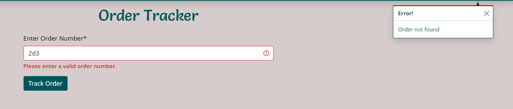
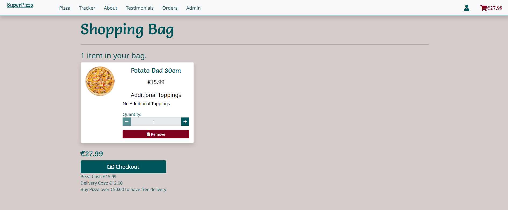
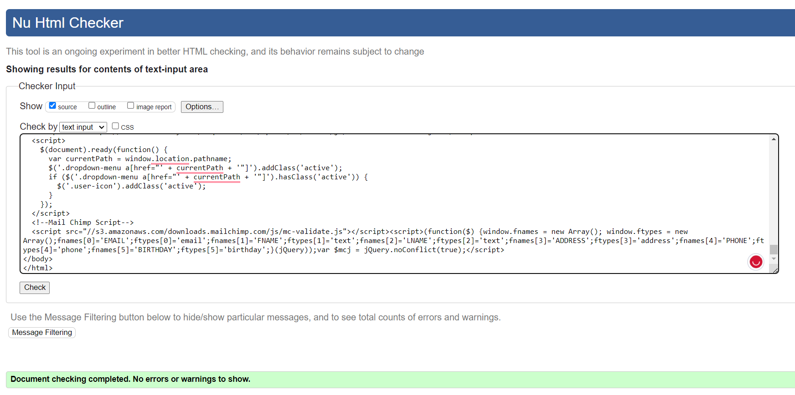
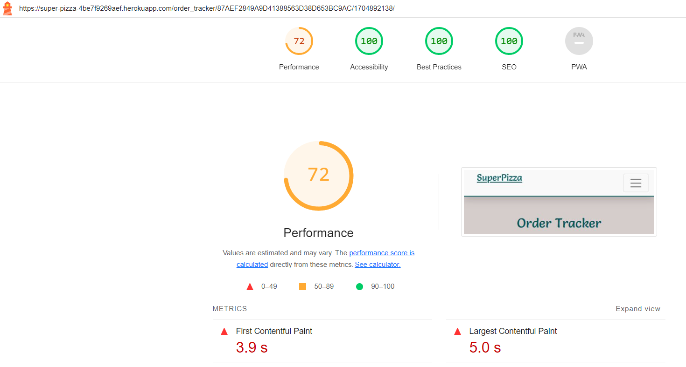

# Super Pizza

Superpizza, our online delivery store in Tralee, offers a seamless user experience, designed for easy navigation. Customers can explore our diverse range of pizzas, select their preferred size, and personalize it by adding extra toppings. They also have the convenience of leaving testimonials to share their experiences.

Our platform includes a secure online payment system and provides an option to track order status from the moment an order is placed until it reaches your doorstep. The intuitive design extends to our workers and administrators, granting them the ability to efficiently manage orders, approve or remove testimonials, and effortlessly modify the store's products such as pizzas and toppings.

Link to the [live website](https://super-pizza-4be7f9269aef.herokuapp.com/)

 

Link to the [github repository](https://github.com/OleksiyLa/Project_5)

 

## Planning & Development

### Target Audience

  - Busy Professionals: Individuals who lack time to cook and prefer the convenience of ordering food online.
  - Families: Parents looking for quick meal solutions or a treat for their children without leaving home.
  - Students: Those living on campus or in nearby areas who enjoy the ease of online ordering for gatherings or individual meals.
  - Food Enthusiasts: People who appreciate customization and quality ingredients in their pizzas.
  - Tech-Savvy Users: Those comfortable with online platforms and seeking a streamlined, user-friendly ordering experience.
  - Local Community Members: Individuals supporting local businesses and seeking easy access to delicious, freshly made pizzas in their area.

### App Objectives

  - User Convenience: Simplify the pizza ordering process for customers, ensuring a seamless and user-friendly interface.
  - Customization: Allow customers to personalize their orders by choosing pizza size, toppings.
  - Efficient Order Management: Enable workers and administrators to efficiently manage orders, ensuring timely processing and delivery.
  - Enhanced Customer Experience: Provide a platform for customers to leave testimonials and feedback, fostering a sense of engagement and trust.
  - Secure Payment Processing: Implement a reliable and secure online payment system to facilitate smooth transactions.
  - Order Tracking: Offer customers the ability to track their orders from placement to delivery, enhancing transparency and reliability.
  - Scalability: Build a platform that can adapt and scale with the growing business needs, accommodating potential expansions or modifications to the menu or services.
  - Marketing and Analytics: Incorporate features to gather data on customer preferences and behavior, aiding in targeted marketing efforts and service improvements.

### Features to Implement

  - Convenient Real-Time Tracking System: Allow users to track their orders in real-time, providing updates from acceptance to delivery stages.
  - Order Management for Workers: A dashboard for workers to view all active new orders and update their status from 'new' to 'done' upon completion.
  - Online Payment System: Integrate a secure online payment gateway for seamless transactions within the app.
  - Registration and Login: Enable users to create accounts and log in to access personalized features and order history.
  - Pizza List Page with Filters: Present a comprehensive list of available pizzas with filter options for easy browsing.
  - Pizza Details and Customization: Offer a detailed view of each pizza with customization options, including the ability to change size, add extra toppings.
  - Add to Bag Functionality: Allow users to add selected items to their shopping bag for a streamlined ordering process.
  - Profile Page for Registered Users: Provide a dedicated space for registered users to manage their information and view past orders.
  - Testimonials Submission: Enable customers to write testimonials to share their experiences with Superpizza.
  - Testimonials Management for Admins: Admins can review, approve and delete testimonials submitted by customers to maintain the integrity of displayed reviews.
  - Store Product Management for Admins: Grant admins the capability to manage products in the store, including adding, editing, or deleting pizzas and toppings from the menu.
  - Responsive Design: Ensure the app is responsive across various devices and screen sizes.

### Wireframes

Pizza Page

  
  
  

Pizza Details Page

  
  
  

Pizza Tracker Page

  
  

Pizza Order Page

  
  

Pizza Order Details Page

  
  

Profile and Order History Pages

  
  

Pizza Basket Page

  

### Database Schema

User Profile:

  - Connected to the User table (custom Django user model). Stores additional user-related information and can prefill certain order fields during checkout.

Testimonial:

  - Connected directly to the User table. Allows users to submit testimonials about their experiences with Superpizza.

Order:

  - Connected to Order Line Item and Order Progress tables. Contains information about individual orders placed by users.

Order Line Item:

  - Connected to Product (through Foreign Key), Topping (through Many-to-Many relationship), and Order tables. Stores details about items within each order, such as product, quantity, size which is enoug to calculate total price of item.

Order Progress:

  - Connected to the Order table. Manages and tracks the status of orders, allowing for efficient order management.

Topping:

  - Connected to Order Line Item through a complementary table (topping_order_line_item) in a Many-to-Many relationship. Represents various toppings available for customizing pizzas.

Product:

  - This table compiles the assortment of pizzas available at the store. It features detailed information for each pizza, including their names, descriptions, prices, and various boolean attributes designed to facilitate product filtering.

### Colors

SuperPizza employs a selection of vibrant colors aimed at enhancing the online experience, those that are the most prominent are:

- Main Color: #00555a
  - The primary color, #00555a, conveys reliability and trust. It guides users seamlessly through the ordering process, portraying efficiency and dependability.

- Main Background Color: #d6cccc
  - The neutral backdrop in #d6cccc creates a welcoming environment, allowing products to stand out distinctly.

- Error Color: #800020
  - The #800020 hue communicates urgency without causing alarm, prompting swift attention to any issues.

- Success Color: #0b5a1d
  - Representing accomplishment and satisfaction, #0b5a1d acknowledges the completion of a successful order.

- Warning Color: #ffd700
  - The #ffd700 color gently alerts users to review details or take necessary actions without being obtrusive.

### Fonts

Noto Sans and Salsa fonts were chosen for Super Pizza's online store to enhance readability and reinforce brand identity. Noto Sans ensures clear and easy-to-read text, while Salsa adds personality to headlines. This choice maintains brand consistency, guides user attention, and ensures a smooth browsing experience across devices and browsers.

- Noto Sans
- Salsa

### Technologies

- Version control: Git + Github
- Deployment: Heroku
- Database: PostgreSQL
- Media + static: Cloudinary
- Payment: Stripe

### Languages

- HTML
- CSS
- JavaScript
- Python

### Libraries / Frameworks

- Django
- Bootstrap
- Font Awesome
- jQuery
- MailChimp

### Agile

#### Epics
- Epic Authentication
  - Registration
  - Login
  - Logout

- Epic Authorization
  - Admin Authorization
  - Worker Authorization

- Epic Admin Product Management
  - Admin Pizza Management
  - Admin Topping Management

- Epic Order Tracking and Management
  - Tracking Every Step of Delivery
  - Accessing and Managing Orders

- Epics Profile
  - Profile page
  - Order History

- Epic Seamless Shopping and Checkout Experience
  - Shopping Bag
  - Online payment

- Epic Streamlined Pizza Browsing
  - View All Pizzas
  - Pizza Details

#### User Stories

Registration
- As a customer I can register for an account so that I can access the platform's features, such as making an order and accessing my profile page
  - Acceptance Criteria:
  - An account activation process is initiated upon successful registration to verify the email address for validity.
  - An automated confirmation email containing an activation link is sent to the registered email address.
  - Clicking the activation link completes the registration process, confirming the account's validity.
  - After activation, the user gains access to the platform's features, including the ability to make orders and access their profile page.

Login
- As a registered user I can log in so that access my profile and make orders
  - Acceptance Criteria:
  - Login functionality verifies user credentials (emai or usernamel/password).
  - Successful login grants access to the user's profile and features

Logout
- As a customer I can log out of my account so that my personal information remains secure and inaccessible to unauthorized users

Admin Pizza Management
  - As a admin I can add new pizza items, update existing ones, or delete pizzas directly on the pizza page so that I can efficiently maintain and modify the available pizza menu
  - Acceptance Criteria:
  - Within the pizza page, an admin-exclusive interface or admin mode is accessible, providing additional functionalities for pizza management.
  - The admin mode or interface includes options to add a new pizza, update details of existing pizzas, or delete pizzas directly from the pizza listing.
  - Adding a new pizza presents a form with fields for essential pizza details (name, description, price, ingredients, image upload) directly on the pizza page.
  - Deleting a pizza triggers a confirmation modal or prompt to prevent accidental deletions.
  - Upon any addition, update, or deletion, the changes are instantly reflected and updated on the pizza page for users.

Admin Topping Management
  - As an admin, I can add new topping items, update existing ones, or delete toppings so that I can efficiently maintain and modify the available toppings
  - Acceptance Criteria:
  - The admin mode or interface includes options to add a new topping, update details of existing toppings, or delete toppings directly from the topping listing.
  - Adding a new topping presents a form with fields for essential topping details (name, price, image upload) directly on the topping page.
  - Deleting a topping triggers a confirmation modal or prompt to prevent accidental deletions.
  - Upon any addition, update, or deletion, the changes are instantly reflected and updated on the topping page for users.

Tracking Every Step of Delivery
  - As a customer, I can track the status of my order so that I can monitor its progress from acceptance to delivery, knowing whether it's accepted, being cooked, prepared for delivery, in transit, or completed.
  - Acceptance Criteria
  - Customer can access the order status through a designated page on the website
  - The system provides real-time updates on the order's progress, including stages like 'Order Accepted,' 'Being Cooked,' 'Prepared for Delivery,' 'Delivering,' and 'Completed.
  - Each stage in the order process is clearly labeled to avoid confusion or ambiguity
  - Visual cues like progress bars or icons complement the textual status updates for easy comprehension of the order's progress

Accessing and Managing Orders
  - As a worker I can access the order page so that I can accept customer orders and update their status for display on the tracking page
  - Acceptance Criteria:
  - Workers have a dedicated or "Orders" section accessible from their dashboard or a designated area in the system.
  - Upon entering the order management page, workers can view a list of pending orders with essential details (e.g., order number, items, customer details, status).
  - Workers have the ability to review order details, including specific items in the order and customer information.
  - Workers can update the status of orders (e.g., new, delivering, delivered)
  - Any status changes made by workers are immediately reflected and updated on the tracking page accessible to customers.

Profile Page
  - As a customer I can view and manage my account details on the profile page so that ** I can access and modify my information easily**
  - Acceptance Criteria:
  - Upon logging in, the user can navigate to the profile page from the main dashboard or navigation menu.
  - The profile page displays the customer's basic information fetched from the database.
  - Users can edit their profile information.
  - Changes made to the profile information are immediately reflected and saved to the database upon confirmation.

Order history
  - As a customer I can review my past orders on the platform so that I can track my purchase history and make informed decisions
  - Acceptance Criteria:
  - Dedicated section within the profile displays a chronological list of orders.
  - Users can click on individual orders to view more detailed information, including order specifics (items, quantities).

Online Payment
  - As a customer, I can pay online so that my pizza is delivered.
  - Acceptance Criteria
  - Confirm that sensitive payment information is handled securely
  - Ensure there is a clear and intuitive process for customers to proceed to checkout after selecting their desired pizzas
  - Verify that users receive a confirmation message or email after successful payment, summarizing the order details and estimated delivery time
  - Redirect the user to a "Checkout Success" page after completing the payment process, displaying relevant order details such as items purchased, total cost, and delivery information

Shopping Bag
  - As a customer I can view all selected products in the basket so that I can review my choices before making a purchase and proceed confidently
  - Acceptance Criteria:
  - The basket icon or link should be prominently displayed and easily accessible from any page on the website.
  - Upon clicking the basket icon/link, a clear and organized display of all selected products with their names, quantities, and prices should be visible.
  - The total cost of all items in the basket should be calculated and displayed.
  - Customers should have the ability to easily modify quantities, remove items, or proceed to checkout directly from the basket page.
  - Changes made to the basket (additions, removals, quantity adjustments) should reflect instantly and accurately.
  - The basket display should be responsive, ensuring a seamless experience across various devices (desktop, mobile, tablet).
  - The basket page should prominently feature a 'Checkout' or 'Proceed to Payment' button, allowing customers to smoothly transition from reviewing their selections to initiating the payment process.

View All Pizzas
  - As a customer I can visit a page displaying all available pizzas so that I can easily browse and select the pizzas I want to order.
  - Acceptance Criteria
  - When the number of pizzas exceeds a defined limit per page, pagination controls should be visible to navigate between different pages of pizza listings
  - Add the ability to filter pizza by Spicy, Vegetarian, Seafood, Premium, New
  - Add text input to search for pizza by title or details
  - Check that each pizza displayed has an 'Add to Cart' button or similar functionality available on the pizza card
  - Ensure the availability of size selection options (30cm, 35cm, and 40cm) for each pizza
  -Price and image of the pizza are displayed on the card

Pizza Details
  - As a customer, I can visit the pizza details page by clicking on any pizza card so that I can view more information about the selected pizza, such as its ingredients, sizes, and customization options.
  - Acceptance Criteria
  - 'Add to Cart' button or similar functionality available on the pizza card
  - Ensure the availability of size selection options (30cm, 35cm, and 40cm) for each pizza
  - Price and image of the pizza are displayed on the card
  - It is possible to customize the pizza by adding additional ingredients, which are reflected in the price

Provide Testimonial
  - As a user, I want to be able to submit a testimonial easily on the platform, so that my positive experiences and feedback can be shared with the community.
  - Acceptance Criteria:
  - The platform should provide a user-friendly testimonial submission form.
  - Authentication is required for users to access the testimonial submission form, ensuring that only registered users can submit testimonials.
  -A user must have purchased at least one order on the platform before being eligible to submit a testimonial.
  - Upon submitting the testimonial, the platform should check the user's purchase history to validate that they have indeed made at least one order.
  - Testimonials submitted by users should not be immediately published on the platform but should instead be in a pending state until approved by an administrator.
  - Admin approval should be necessary for a testimonial to be shared with other users.

View Testimonials
  - As a user, I want to be able to view and browse testimonials submitted by other users, so that I can gain insights into their experiences.
  - Acceptance Criteria:
  - There should be a dedicated section or page on the platform where testimonials are displayed.
  - Testimonials should be organized in a visually appealing and easy-to-read format.
  - Each testimonial should include the user's name, the date, rating and testimonial.

#### Kanban Board

Link to the [Kanban Board](https://github.com/users/OleksiyLa/projects/3/views/1)

#### Retrospective

- Introduction:

  - In navigating the complexities of a time-constrained project within an emerging technology landscape, I embraced an adaptive approach by incorporating Agile methodology. Recognizing the challenges posed by short timeframes, I leveraged Agile principles alongside the utilization of a Kanban board to enhance my workflow and efficiently deliver results.

- Adaptability in Work Approach:

  - Acknowledging the limitations of time and the dynamic nature of the technology at hand, I adopted an adaptability approach, ensuring flexibility in my work processes. Rather than strictly adhering to traditional sprint structures, I tailored my approach to suit the unique demands of the project.

- Kanban Board Implementation:

  - To visualize and manage the flow of tasks, I implemented a Kanban board. This visual management tool provided transparency into the progress of work items, allowing me to prioritize effectively and optimize resource allocation. The Kanban board became a central hub for tracking tasks, minimizing bottlenecks, and fostering a collaborative work environment.

- Work Breakdown Structure:

  - In tandem with the Kanban board, I organized the project using the concept of epics and user stories. Work was categorized into broader epics, representing high-level functionalities, and further broken down into granular user stories. This hierarchical breakdown facilitated a more manageable and iterative development process.

- Single-Sprint Development:

  - Given the compressed timeframe, I consolidated my development efforts into what would traditionally be considered a single sprint. Strategic task prioritization and a dynamic Kanban board allowed for efficient management of the condensed timeline, ensuring maximum productivity.

- Iterative Development Cycle:

  - Aligned with Agile principles, I maintained an iterative development cycle. Regular feedback loops, facilitated by the Kanban board, were established to assess progress, identify potential impediments, and make real-time adjustments. This iterative approach ensured continuous improvement and alignment with evolving project requirements.

- Results and Achievements:

  - The incorporation of Agile principles, coupled with the use of a Kanban board, yielded significant outcomes. The visual representation of tasks on the Kanban board enhanced project visibility, and the adaptability approach allowed for effective navigation of challenges. The combination of these methodologies within a single-sprint development framework resulted in tangible achievements and successful project delivery.

- Challenges and Learnings:

  - The integration of Agile and Kanban in a time-constrained environment posed unique challenges, emphasizing the need for dynamic planning and effective use of visual tools. The experience underscored the importance of adaptability and continuous improvement, as insights gained from the Kanban board informed real-time adjustments to the work approach.

- Conclusion:

  - In conclusion, the application of Agile methodology, enriched by the implementation of a Kanban board, proved to be a potent combination. By fostering adaptability, visualizing work through the Kanban board, and maintaining an iterative development cycle, I navigated challenges successfully and delivered results aligned with project objectives. This experience reinforces the efficacy of Agile and Kanban principles in optimizing workflows, particularly in environments characterized by time constraints and evolving technological landscapes.

## Business Model

  - SuperPizza operates as a Business-to-Customer (B2C) online pizza delivery service, focusing on delivering high-quality pizzas directly to individual consumers in Tralee. Emphasizing customer satisfaction, the business model centers on providing convenient and premium culinary offerings.

## Marketing Strategy

 In the pursuit of a strong brand reputation and active engagement within the local Tralee community, SuperPizza has strategically implemented various marketing initiatives:

### Brand Establishment

  - SuperPizza Website: Serving as the primary branding platform, the website showcases the commitment to delivering quality pizzas to the Tralee populace. Meticulous optimization with targeted keywords such as "Tralee pizza delivery," "quality pizzas in Tralee," "fast pizza delivery," and "diverse pizza menu" enhances visibility and accessibility for local customers seeking pizza delivery services.

### Social Media Presence
  
  - Facebook Page: Maintaining an active presence on Facebook, SuperPizza leverages this social media platform to connect and engage with the local community. Functioning as a central hub for updates, promotions, and direct customer interaction, it amplifies our digital presence, complementing SEO efforts to extend reach and engagement within the community.

### Customer Engagement Strategies

  - Email Subscription via MailChimp: Offering an email subscription service through MailChimp keeps customers informed about the latest offers, menu expansions, and exclusive deals. These initiatives are complemented by website SEO optimizations, ensuring seamless access to relevant information for potential customers.

### Localization and Community Involvement

  - Localized Marketing: Tailoring marketing efforts to resonate with the people of Tralee emphasizes dedication to serving the local community. Website SEO strategies facilitate effective delivery of localized messages to the intended audience.

  - Community Collaborations: Active participation in local events and collaborations with community initiatives foster stronger connections within the Tralee populace. Website SEO practices contribute to enhanced visibility in local searches, encouraging community engagement.

### Search Engine Optimization (SEO)

  - SuperPizza's website is meticulously optimized with targeted keywords such as "Tralee pizza delivery," "quality pizzas in Tralee," "fast pizza delivery," and "diverse pizza menu." These strategic SEO practices significantly enhance the website's visibility and accessibility for local customers actively seeking pizza delivery services in Tralee. The emphasis on SEO complements SuperPizza's marketing strategies, ensuring the website ranks prominently in relevant search results, thereby attracting and engaging potential customers effectively.

### Conclusion
SuperPizza's comprehensive B2C model and strategic marketing initiatives, incorporating robust SEO practices and targeted keywords, aim to establish a resilient online presence and deeply engage the local Tralee community. The commitment remains centered on delivering exceptional pizza experiences while continuously enhancing brand visibility, accessibility, and reach through effective SEO strategies.

## Features

### Existing Features

The first page showcases a variety of pizzas with implemented pagination to enhance user experience. Users can filter pizzas by categories and use a search function to locate pizzas based on name or description.

Each pizza card displays key information, including an image, name, description, price, and size. The default size is 30cm, and users can switch to 35cm or 40cm by clicking the highlighted button. As the size changes, so does the price, and the pizza image adjusts accordingly. A prominently displayed "Add to Bag" button facilitates quick addition to the bag.

Upon clicking "Add to Bag," the selected pizza is added to the user's bag. Additionally, clicking the pizza image redirects the user to the detailed page for that specific pizza.

The pizza details page displays the pizza's name, description, price, and size. Users can customize the pizza by selecting additional toppings. The price adjusts accordingly, and the pizza card updates to reflect the selected toppings. The user can then add the customized pizza to their bag. The larger the size, the more expensive the toppings become.

The bag page displays all items added to the bag. Users can adjust the quantity of each item, remove items, or proceed to checkout. The total price is calculated based on the quantity and size of each item. The delivery cost is added to the total if the order is less than €20. The user can also return to the pizza list page to add more items to the bag.

Clicking the "Checkout" button redirects the user to the checkout page. The user can review the order details, including the items, quantities, and total price. The user can also modify the order by returning to the bag page. The checkout page features a form for entering personal details and payment information. The user can also opt to save their information to their profile for future orders. The user can then click the "Complete Order" button to finalize the order.

Upon completing the order, the user is redirected to the checkout success page. This page displays the order details, including the items, quantities, total price, and delivery information. The user can also view the order details in their profile. The user receives an order confirmation email.

Track Order page allows users to track their order in real-time. The page displays the order status of active orders. The user can also view the order details, including the items, quantities, and total price.
The order number can be used to track the order status on the tracking page. 
The order number serves as a unique identifier, enabling users to conveniently track the status of their orders on our dedicated tracking page. By inputting the order number into the provided form, users can quickly locate and monitor the current status of their active orders. This streamlined process is not only user-friendly but also offers added convenience, allowing users to easily share the order progress bar with others for tracking purposes.

To ensure security, accessing this feature requires a sophisticated order number, providing an additional layer of protection. The complexity of the order number, coupled with the encrypted URL displaying both the order number and the timestamp of its creation, ensures a secure and seamless experience for users tracking their orders.

The order status is updated by workers or admins. The order status can be changed from "New" to "Accepted," "Cooking," "Preparing," "Delivering," and "Done." The order status can only progress sequentially from one stage to the next until reaching the "Done" status. The order status changes are instantly reflected on the customer's progress bar interface. When the order is completed, the worker or admin can click the "Archive" button to finalize the order and render it inactive. The order is then will not be displayed on the tracking and orders page.

The profile page displays the user's basic information, and the user can edit their profile details. Any changes made to the profile will be prefilled on the checkout page. The user can also view their order history, including the order number, items, quantities, and total price. The user can click on individual orders to view more detailed information, including order specifics (items, quantities). if the order is active, the user can track the order status by clicking the "Track Order" button in the order details.

The testimonials page displays testimonials submitted by users. The testimonials are organized in a visually appealing and easy-to-read format. Each testimonial includes the user's name, the date, rating, and testimonial. The testimonials are in a pending state until approved by an administrator. Admin approval is necessary for a testimonial to be shared with other users. The testimonials page also features a form for submitting testimonials. Authentication is required for users to access the testimonial submission form, ensuring that only registered users can submit testimonials. A user must have purchased at least one order on the platform before being eligible to submit a testimonial. Upon submitting the testimonial, the platform checks the user's purchase history to validate that they have indeed made at least one order.

The admin panel is accessible to admins only. It features a dedicated navigation link and a dropdown menu in the profile section. The admin panel allows admins to manage products in the store, including adding, editing, or deleting pizzas and toppings from the menu. Admins can also approve or delete testimonials submitted by customers to maintain the integrity of displayed reviews. Admins can also access the order management page to view all active new orders and update their status from 'new' to 'done' upon completion.

About page provides information about the company.

On the footer, users can subscribe to the newsletter by entering their email address as well users can see social links and info about opening hours, location and contacts. MailChimp is used to manage the subscription list.

There are three user types: authenticated users, workers, and admins. While admins have access to the Orders page to manage orders, providing admin accounts to workers could pose a security risk, as it would grant them access to the database. Instead, admins can assign worker status to specific users as needed.

Responsive design ensures the website is accessible and functional across various devices and screen sizes.

Intuitive and user friendly interface for admins to manage orders.
Good user experience for customers, including the ability to track orders in real-time, view order history, and submit testimonials.

### Future Features

- Statistics: Implement a statistics page to display key metrics, including the number of orders, total revenue, and average order value. This page would be accessible to admins only. The statistics page would also feature a graph to visualize the number of orders over time.
A statistics page is slated for implementation, aiming to calculate average order processing times and the duration between different status transitions. The necessary fields in the database will be utilized for these calculations. This feature is designed to identify potential bottlenecks and assess employee efficiency, providing a valuable tool for analyzing operational performance and optimizing processes.

- Like button for pizza: Implement a like button for pizzas to allow users to express their preferences. This feature would be accessible to authenticated users only. The number of likes would be stored in the database and used to calculate the most popular pizzas.

- Pizza recommendations: Implement a pizza recommendation feature to suggest pizzas based on user preferences. The recommendation algorithm would utilize the number of likes for each pizza to identify the most popular pizzas and recommend them to users.

- Order cancellation and editing: Implement the ability for workers to cancel or edit orders. This feature would be accessible to workers and admins only. The order cancellation feature would be useful in cases where customers change their minds or cancel their orders. The order editing feature would allow workers to modify orders as needed.

## Testing

### Manual Testing

#### Authentication

  - Verified the functionality of the registration form, ensuring all required fields are present and functional.

  - Validated the form's behavior when submitting incomplete or erroneous data (e.g., missing fields, invalid email format).
  - Tested the form's responsiveness across various devices to ensure usability.
  - Checked that successful registration results in the creation of a user account.

  - Verified that users receive confirmation emails.

  - Tested the login functionality to authenticate registered users.

  - Verified that incorrect login credentials trigger appropriate error messages.
  - Tested the "Forgot Password" feature to confirm its functionality in allowing users to reset their passwords.

#### Authorization

- Authenticated User
  - Confirmed that authenticated users can access and manage their profiles.
  - Validated the functionality to view order history and edit personal details for checkout.
  - Verified that authenticated users with at least one order can write testimonials.
  - Ensured testimonial submission is restricted until the user meets the minimum order requirement.

- Worker
  - Tested the additional "Orders" navigation link accessible to workers.

- Admin
  - Validated additional profile dropdown menu options available to admins.
  - Confirmed functionality to add pizzas, toppings, and provide testimonials from the admin profile.
  - Checked access to the admin panel through the designated navigation link.

Admin Authorization

  
  
  
  
  

  - Verified admin privileges within the admin panel, including editing/deleting products and testimonials.
  - Ensured that under product cards (e.g., pizzas, toppings), admins can access links to edit or delete them.
  - Verified admin access to approving or deleting testimonials.

#### Form Validation

  - Validated Add Pizza form.

  - Validated Edit Pizza form.

  - Validated Add Topping form.

  - Validated Edit Topping form.

  - Validated Login form.

  - Validated Registration form.

  - Validated Profile form.

  - Validated Checkout form.

  - Validated Provide Testimonial form.

  - Validated Track Order form.

#### Crud

  - Verified that admins can successfully add new pizzas and toppings to the system.

  - Verified that admins can successfully update pizza or topping.

  - Verified that admins can successfully delete pizza or topping.

  - Confirmed that images associated with pizzas or toppings created and deleted in Cloudinary.
  - Ensured the ability for users to create testimonials and submit them successfully.
  - Validated admin functionality to approve submitted testimonials.

  - Confirmed that admins can delete testimonials as needed.

  - Verified that users can add pizzas to their shopping bag successfully.

  - Tested the removal of pizzas from the bag to ensure functionality.

  - Confirmed that users can modify the quantity of pizzas in their bag and that these changes reflect accurately.

  - Validated the ability for users to add toppings to their pizzas.

#### Price

  - Confirmed that the price of a pizza changes correctly based on the selected size (30cm, 35cm, 40cm).

  - Validated that the price of extra toppings adjusts according to the size of the pizza.

  - Verified that adding extra toppings increases the pizza's price by the respective cost of each topping.

  - Ensured that the delivery cost is correctly applied or omitted based on the total price of pizzas in the order.

  - Confirmed that the grand total price changes accurately based on the quantity of pizzas added to the shopping bag.

  - Checked that all applicable adjustments (size, toppings, delivery cost) reflect in the final calculated total.

#### Payment

  - Verified that items added to the shopping bag correctly transfer to the checkout page.
  - Ensured the displayed prices in the checkout match those in the shopping bag.
  - Validated the input of card details for payment.
  - Confirmed that the price taken during the payment process matches the total displayed during checkout.

  - Validated successful payment events in the Stripe dashboard.

  - Tested and verified webhook functionality to ensure it works as expected.

  - Checked that users receive an order confirmation email after successful payment and completion of the checkout process.

  - Confirmed that users are redirected to a "Checkout Success" page after completing the payment. Validated that this page displays relevant order details such as items purchased, total cost, and delivery information.

#### Profiles
  - Ensured that the details entered in the profile form are pre-filled in the checkout form for user convenience.

  - Confirmed that the orders in the profile are displayed in chronological order, with the most recent order at the top.
  - Tested the functionality to view detailed information for each order upon clicking.

  - Verified that for active orders, a track order button is displayed within the order details.
  - Ensured the functionality of the track order button to provide real-time status updates for the user.

#### Tracking System

  - Confirmed that when a customer purchases a pizza, an active order is created for tracking purposes.
  - Tested the functionality to display the order's status progression (pending, accepted, cooking, preparing, delivering, delivered) on the customer's screen via a progress bar.
  - Ensured that status changes made by workers or admins are instantly reflected on the customer's progress bar interface.
  - Verified that workers or admins can view new orders as they are created.
  - Tested the functionality for workers or admins to change the order status (e.g., from accepted to cooking, preparing, delivering).
  - Ensured that order status changes can only progress sequentially from one stage to the next until reaching the "Done" status.
  - Validated the functionality of the "Archive" button for completed orders, making them inactive and invisible to both workers and customers.

Tracking System

  
  
  
  
  
  
  
  
  
  
  
  
  
  

#### Responsiveness

  - Verified the website's responsiveness on different screen sizes (e.g., mobile, tablet, desktop).
  - Confirmed that content layout and elements adjust appropriately to fit various screen resolutions.
  - Checked the readability of text, clarity of images, and accessibility of navigation menus on all screen sizes.
  - Ensured that buttons, links, and interactive elements are easily clickable and usable across different devices.
  - Validated that the design maintains visual consistency and integrity across all screen sizes.
  - Confirmed that images, fonts, and overall aesthetics are consistent and appealing irrespective of the screen dimensions.

Responsive (iPad and mobile images)

  
  
  

#### Navbar

  - The navbar has been tested on all pages and all links are working correctly.
  - The navbar has been tested on all screen sizes and the links are displayed correctly.
  - The selected page link is highlighted in the navbar.
  - The dropdown menu has been tested on all screen sizes and the menu works correctly.
  - The burger appears on small screens and the menu is displayed when the burger is clicked.
  - The links in the burger menu have been tested and all links are working correctly.
  - Authenticated users can view and access their profiles from the dropdown menu located under the profile icon.
  - Workers can see and have access to Orders link.
  - Admins can see and have access to Orders and Admin links. From the dropdown menu of the profile icon, the admin has additional options to add pizza, add toppings, and provide testimonials.

#### Footer

  - The footer appears on all pages.
  - The footer is displayed correctly on all screen sizes.
  - The footer links have been tested and all links are working correctly.
  - The MailChimp subscription form has been tested and the form works correctly.
  - The information like "Opening Hours", "Our Location" and "Contact Us" is displayed correctly.

### HTML Validation

  - All HTML files have been validated using the W3C HTML Validator, with no errors or warnings found.

Login, Sign Up

  
  

Pizza List, Pizza Detail, Add and Edit Products Forms

  
  
  
  
  
  

Shopping Bag, Checkout, Checkout Success, Profile

  
  
  
  

About, Testimonials, Provide Testimonials

  
  
  

Order Status Management, Tracker, Tracker Progress Bar

  
  
  

### CSS Validation

  - The CSS code has been validated using the W3C CSS Validator (Jigsaw), and no errors were found.

Order Status Management, Tracker, Tracker Progress Bar

  
  
  
  

### JavaScript Validation

  - The JavaScript file has been validated using the JSHint JavaScript Validator, and no errors were detected."

Validated bag.js, checkout_stripe.js, products_pizza_detail, products_pizza_list.png, static_index.js files

  
  
  
  
  

### Python Validation

  - The Python PEP8 validation tests were performed to assess the adherence of the application's Python code to the PEP8 style guide and no errors were detected.

Validated python files from about app

  
  

Validated python files from bag app

  
  
  

Validated python files from checkout app

  
  
  
  
  
  
  
  
  

Validated python files from order_status_management app

  
  
  

Validated python files from order_tracker app

  
  
  

Validated python files from products app

  
  
  
  
  
  

Validated python files from profiles app

  
  
  
  

Validated python files from superpizza app

  
  

Validated python files from testimonial app

  
  
  
  

Validated python files from users app

  

### LightHouse

A comprehensive Lighthouse audit was performed on multiple pages across the website, evaluating their performance on both mobile and desktop platforms. The assessment covered essential aspects including SEO, best practices, accessibility, and performance metrics.

SEO & Best Practices:
Consistently, across almost all pages, the website scored a commendable 100 in SEO and best practices, showcasing strong optimization and compliance with industry standards.

Accessibility:
Accessibility across the pages consistently demonstrated strong scores falling within the 95-100 range, ensuring high inclusivity and usability for a diverse audience.

Performance:
The Lighthouse audit for mobile devices primarily targeted pages with substantial content. The evaluation yielded an average performance score above 70, indicating a satisfactory level considering the content density. Despite this, there remains room for improvement to further refine the user experience on these content-rich pages.

Lighthouse testing images

  
  
  
  
  
  
  
  
  
  
  
  
  
  
  
  
  
  
  
  
  
  
  
  

The website demonstrates consistent adherence to SEO, best practices, and strong accessibility scores between 95-100 across multiple pages. Nevertheless, the mobile performance, especially on content-heavy pages, presents an opportunity for enhancement. Addressing these aspects could significantly improve the overall user experience, aligning mobile performance more closely with the robust desktop performance observed.

### User Stories Testing

Registration

- Test Email Activation:
  - Verify that a new user receives an account activation email upon successful registration.
  - Confirm that clicking the activation link completes the registration process and grants access to platform features.

Login

- Test Successful Login:
  - Confirm that a registered user can successfully log in using valid credentials.
  - Ensure that successful login grants access to the user's profile and features.

Logout

- Test Logout Functionality:
  - Validate that a user can successfully log out of their account.
  - Ensure that personal information is secured and inaccessible after logout.

Admin Pizza Management

- Test Adding Pizza:
  - Navigate to the admin interface and verify the ability to add a new pizza.
  - Confirm that the addition instantly reflects and updates on the pizza page for users.
- Test Updating Pizza:
  - Access the admin interface and update details of an existing pizza.
  - Confirm that changes are immediately reflected and updated on the pizza page for users.
- Test Deleting Pizza:
  - Navigate to the admin interface and attempt to delete a pizza.
  - Verify that a confirmation prompt prevents accidental deletions.

Admin Topping Management

- Test Adding Topping:
  - Access the admin interface and verify the ability to add a new topping.
  - Confirm that the addition instantly reflects and updates on the topping page for users.
- Test Updating Topping:
  - Access the admin interface and update details of an existing topping.
  - Confirm that changes are immediately reflected and updated on the topping page for users.
- Test Deleting Topping:
  - Navigate to the admin interface and attempt to delete a topping.
  - Verify that a confirmation prompt prevents accidental deletions.
  - Tracking Every Step of Delivery
- Test Order Status Tracking:
  - Access the order tracking page and verify real-time updates on the order's progress.
  - Confirm that each stage is clearly labeled with visual cues for easy comprehension.
  - Accessing and Managing Orders
- Test Order Management Page:
  - Access the order management page and verify the display of pending orders.
  - Confirm the ability to review order details and update order status.

Profile Page

- Test Profile Information Editing:
  - Log in as a user, navigate to the profile page, and edit profile information.
  - Confirm that changes made are immediately reflected and saved to the database.

Order History

- Test Order History Display:
  - Access the order history section in the profile.
  - Verify the chronological list of orders and the ability to view detailed information on individual orders.

Online Payment

- Test Secure Online Payment:
  - Initiate an online payment transaction and confirm that sensitive information is handled securely.
  - Verify a clear and intuitive checkout process, confirmation message, and redirection to a "Checkout Success" page.

Shopping Bag

- Test Basket Functionality:
  - Add multiple items to the basket, and verify that the basket icon accurately displays the total cost.
  - Confirm the ability to modify quantities, remove items, and proceed to checkout seamlessly.

View All Pizzas

- Test Pizza Pagination and Filtering:
  - Navigate to the page displaying all available pizzas.
  - Verify pagination controls and the ability to filter pizzas by categories (Spicy, Vegetarian, Seafood, Premium, New).
- Test Pizza Search Functionality:
  - Use the text input to search for a specific pizza by title or details.
  - Confirm that the search returns relevant results.

Pizza Details

- Test Pizza Customization:
  - Click on a pizza card to view its details.
  - Verify the availability of size selection options and the ability to customize the pizza with additional ingredients.

Provide Testimonial

- Test Testimonial Submission:
  - Log in as a user who has made at least one purchase.
  - Attempt to submit a testimonial and verify the testimonial is in a pending state awaiting admin approval.

View Testimonials

- Test Testimonial Display:
  - Navigate to the testimonials section and verify the organized display of testimonials.
  - Confirm that each testimonial includes the user's name, date, rating, and content.

## Deployment

### Initial Deployment
- The Task Manager App was deployed to Heroku using the following steps:
  - Create a virtual environment and install Django.
    - python -m venv myenv
    - myenv\Scripts\activate
    - Install Django using pip install Django
  - Create a project and app.
    - django-admin startproject project_name
    - cd project_name
    - python manage.py startapp app_name
  - Heroku setup
    - Log in to Heroku or create an account if required.
    - Click "Create new app".
    - Select the relevant region.
    - Enter a unique app name.
    - Click "Create app".
  - Update Django settings for Heroku.
    - Ensure DEBUG is set to False.
    - Update ALLOWED_HOSTS to include your Heroku app's domain.
    - Update the DATABASES configuration to use dj_database_url for the Heroku PostgreSQL database.
    - Add logic for Heroku-specific configurations, e.g., handling static files.
      - Set STATICFILES_STORAGE and DEFAULT_FILE_STORAGE to Cloudinary storage classes.
      - Update STATIC_ROOT and MEDIA_URL.
  - Install dependencies.
  - Prepare requirements file.
    - Use pip3 freeze > requirements.txt to generate a requirements.txt file listing the Python dependencies for your project.
  - Create a Procfile.
    - Create a Procfile to declare what commands are run by your app's dynos on the Heroku platform. For example, for a Django project, it might contain: web: gunicorn your_app_name.wsgi.
  - Push project to GitHub.
    - Push your project to a GitHub repository.
  - Configure environment variables.
    - Scroll down to the "Config Vars" section.
    - Click "Reveal Config Vars".
    - Add the following environment variables:
    - CLOUD_NAME,
    - API_KEY,
    - API_SECRET,
    - DATABASE_URL: Link to your PostgreSQL database.
    - PORT: Set the value to 8000.
    - SECRET_KEY: Set the Django secret key for your application.
  - Set buildpack.
    - Scroll down to the buildpacks section of the settings page.
    - Click "Add buildpack".
    -  Select "Python" and save changes.
  - Deployment configuration.
    - Navigate to the "Deploy" tab.
    -  Connect your Heroku app to the GitHub repository containing your project.
    -  Choose the branch to deploy.
  - Deploy to Heroku.
    - Trigger the deployment process in Heroku either manually or set up automatic deployments.
    -  Initiate the deployment process in Heroku.
    -  Monitor the build logs to ensure successful deployment
  - Access live application.
    - Once deployed, click "View" in Heroku to access your live application.

### Development Deployment
  - Develop Project and Implement Changes
  - Make necessary changes, implement features, or update code within your project locally.
  - After installing new packages, update requirements.txt with freeze > requirements.txt command.
  - After properly configuring settings.py, add and commit changes to Git.
  - Set Missing Configuration Variables in Heroku
    - EMAIL_HOST_PASS
    - EMAIL_HOST_USER
    - STRIPE_PUBLIC_KEY
    - STRIPE_SECRET_KEY
    - STRIPE_WH_SECRET
  - Redeploy to Heroku

### Finalize Deployment
  - Validate Redeployed Application
    - Test the live application on Heroku by accessing the deployed URL.
    - Monitor logs and functionalities to ensure everything operates as expected.

## Credits

### Content
- The Salsa and Noto Sans fonts were obtained from Google Fonts: https://fonts.google.com

### Media
- All SVG icons, including the favicon, were sourced from FontAwesome and Bootstrap icons: 
    - https://fontawesome.com
    - https://icons.getbootstrap.com/

### Code
- Stripe payment functionality was inspired by the Code Institute Boutique Ado project: https://codeinstitute.net/ie/

### Frameworks and Libraries
- Django Docs: https://docs.djangoproject.com/en/4.2/
- Bootsrap5: https://getbootstrap.com/docs/5.3/getting-started/introduction/
- jQuery: https://jquery.com/

### README
- The color palette images featured in the README was sourced from the website http://colormind.io/
- The text content in the README was composed with the assistance of ChatGPT: https://chat.openai.com
- The validation image for HTML were captured from: https://validator.w3.org/
- The validation image for CSS were captured from: https://jigsaw.w3.org/css-validator/
- The validation image for JS were captured from: https://jshint.com/
- The validation image for Python were captured from: https://pep8ci.herokuapp.com/#
- Database model image was created with the assistance of Draw Sql: https://drawsql.app/
- Balsamique was used to create wireframes and facebook mockup page: https://balsamiq.com/